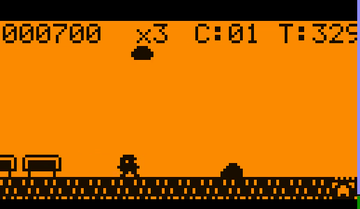
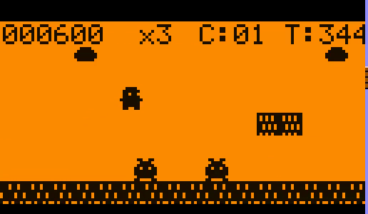

# Super Mario Bros — Flipper Zero

A side-scrolling platformer for the Flipper Zero, ported from the 1985 NES *Super Mario Bros.* The level geometry, physics, and music are derived from the published [SMB1 disassembly (SMBDIS.ASM)](https://github.com/nwoeanhinnogaehr/smb-assembler), scaled down to a 128×64 1-bit screen.




## Features

- All 32 SMB1 levels (worlds 1-1 through 8-4) with castles, pits, pipes, bricks, ?-blocks
- Goomba and Koopa enemies with SMB1-accurate behaviors (walk, stomp, shell kick, ledge turn for red koopas)
- Mushroom power-up → big Mario; crouch with Down-arrow to fit through 1-tile gaps
- Variable-height jump with coyote time + jump buffer
- Double-tap a direction to sprint
- Overworld theme decoded byte-for-byte from SMBDIS's Square-2 channel data, plus jump/stomp/coin/powerup/1-up/death/win SFX
- Title menu with Controls page and Settings page (Music vol / SFX vol / Brightness sliders)
- Hold OK to quit (confirmation overlay)

## Install (no build needed)

A pre-built `.fap` is shipped in this repo and attached to each [GitHub Release](https://github.com/gdavidss/flipper-super-mario-bros/releases):

- [`releases/flipper_mario_v0.2.fap`](releases/flipper_mario_v0.2.fap)

Drop it into `SD/apps/Games/` on the Flipper (via qFlipper's file manager) and launch from Apps → Games.

## Building from source

Requires [ufbt](https://github.com/flipperdevices/flipperzero-ufbt):

```sh
ufbt           # build flipper_mario.fap
ufbt launch    # build + push to a connected Flipper + run
```

The `.fap` lands at `dist/flipper_mario.fap` and `/ext/apps/Games/flipper_mario.fap` on the SD card.

## Controls

| Action | Button |
|---|---|
| Move | D-pad ← / → |
| Jump | Back |
| Sprint | Double-tap a direction and hold |
| Crouch (big Mario only) | Down |
| Navigate menu | Up / Down |
| Adjust setting | Left / Right |
| Select / cycle setting | OK |
| Quit | Hold OK |

## Project layout

```
application.fam      # Flipper app manifest
flipper_mario.c      # game loop, physics, rendering, menu, input
sprites.h            # 8x8 monochrome sprite atlas
sound.h              # piezo sequencer + SMB1 music/SFX
level_format.h       # tile table + Level struct
level_<world>_<n>.h  # 32 levels (1-1 through 8-4)
icon.png             # 10x10 app icon
tools/host_sim/      # desktop "emulator" that runs flipper_mario.c against
                     # a 600-line Furi/Canvas/Gui stub, used to record video
                     # without a physical device. See videos/README.md.
tools/               # original USB-RPC capture pipeline (kept for reference)
videos/              # side-by-side mp4s (Flipper left, NES SMB1 right)
```

## Recording side-by-side videos (no device needed)

The Flipper-side gameplay in `videos/*.mp4` is rendered by running this
app's source code as a host process. There is no upstream Flipper host
target, so `tools/host_sim/` ships a minimum-viable stub of the Furi /
Canvas / Gui APIs the game actually uses (~35 symbols, ~600 lines). See
`EMULATION_RESEARCH.md` for why this was the chosen path.

```sh
bash tools/host_sim/build.sh
python3 tools/host_sim/play_all.py    # plays + composes all 32 levels
```

## Credits

- Original game: Nintendo, 1985 (Koji Kondo — music)
- SMB1 NES disassembly: Doppelganger, mirrored in [nwoeanhinnogaehr/smb-assembler](https://github.com/nwoeanhinnogaehr/smb-assembler)
- Port: Gui Dávid
